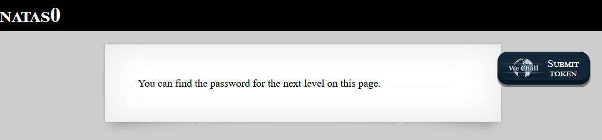
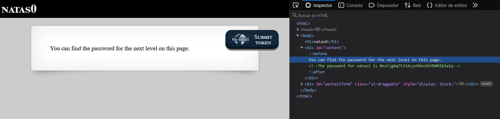

# Laboratorio OverTheWire Natas 0

## Objetivo
El objetivo de este nivel es encontrar la contraseña para poder acceder al siguiente, **natas1**.

## Acceso al nivel
Para entrar nos dieron las siguientes credenciales:  

```
Username: natas0
Password: natas0
URL: http://natas0.natas.labs.overthewire.org/
```

Ingresé en la página usando esos datos y al cargar me salió un mensaje que decía:  
> "_Puedes encontrar la contraseña para el siguiente nivel en esta página._"



## Mi proceso paso a paso

Lo primero que hice fue abrir las herramientas del navegador (clic derecho → *Inspeccionar elemento*). Para ver si habia algo en el codigo fuente de la página web

Al revisar el código, encontré un comentario que contenía la contraseña de `natas1`.  
    
```html
<!-- La contraseña para natas1 es 0nzCigAq7t2iALyvU9xcHlYN4MlkIwlq -->
```




Con esa contraseña podemos continuar y avanzar al siguiente nivel.

## Observaciones y recomendaciones

* Encontrar contraseñas en comentarios HTML es un fallo muy común en entornos de práctica.

* En sistemas reales esto sería un grave problema de seguridad, porque cualquier persona con acceso al navegador puede ver esos comentarios.


## Conclusión

En este laboratorio podemos ver que mucha de las fallas pueden estar en el codigo fuente.  Revisar el código fuente y los comentarios es clave para encontrar contraseñas u otras informacion que podrian dejar los programadores.