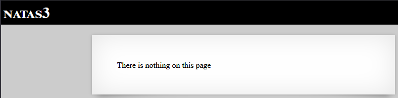
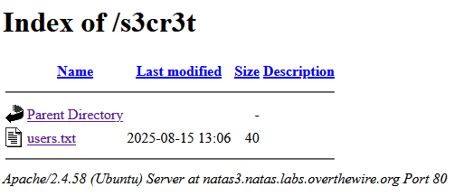

# Laboratorio OverTheWire — Natas level3

## Objetivo

El objetivo de este nivel es encontrar la contraseña para acceder al siguiente, **natas4**.

## Acceso al nivel

Las credenciales se obtienen en el nivel anterior (**natas2**):

```
Username: natas3
Password: 3gqisGdR0pjm6tpkDKdIWO2hSvchLeYH
URL: http://natas3.natas.labs.overthewire.org/
```

Al iniciar, la página muestra el mensaje: “No hay nada en esta página”.



## Proceso paso a paso

Lo primero fue inspeccionar el HTML por si hubiera alguna pista incrustada; no encontré nada relevante. Como siguiente paso pensé en buscar rutas o ficheros ocultos en el servidor, así que lancé una enumeración de directorios con Gobuster usando una wordlist común y las credenciales del nivel:

```bash
gobuster dir -u http://natas3.natas.labs.overthewire.org/ \
-w /usr/share/dirb/wordlists/common.txt \
-U natas3 -P 3gqisGdR0pjm6tpkDKdIWO2hSvchLeYH
```

Resultados relevantes:

```
/.hta                 (Status: 403) [Size: 298]
/.htaccess            (Status: 403) [Size: 298]
/.htpasswd            (Status: 403) [Size: 298]
/cgi-bin/             (Status: 403) [Size: 298]
/index.html           (Status: 200) [Size: 923]
/robots.txt           (Status: 200) [Size: 33]
/server-status        (Status: 403) [Size: 298]
```

Entre los resultados hubo varios ficheros que devolvían 403, pero llamó la atención `/robots.txt` porque devolvía 200. Como robots.txt suele listar rutas que no se quieren indexar, abrí ese archivo y contenía:
   
```
   User-agent: *
   Disallow: /s3cr3t/
```

Esa entrada sugirió que probablemente existiera el directorio `/s3cr3t/`, así que accedí a **http://natas3.natas.labs.overthewire.org/s3cr3t/**. 



En el índice del directorio apareció un fichero `users.txt`; al abrirlo encontré la contraseña del siguiente nivel:

**natas4:QryZXc2e0zahULdHrtHxzyYkj59kUxLQ**

## Conclusión

En entornos reales hay que evitar almacenar credenciales en ficheros accesibles públicamente, no confiar en robots.txt para ocultar rutas sensibles (no es un mecanismo de seguridad) y desactivar o proteger los listados de directorios mediante permisos y controles de acceso adecuados.