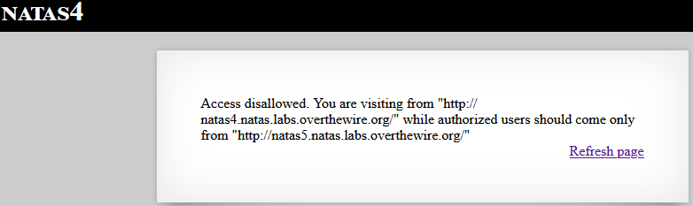

# Laboratorio OverTheWire — Natas level4

## Objetivo

El objetivo de este nivel es encontrar la contraseña para acceder al siguiente, **natas5**.

## Acceso al nivel

Las credenciales se obtienen en el nivel anterior (**natas3**):

```
Username: natas4
Password: QryZXc2e0zahULdHrtHxzyYkj59kUxLQ
URL: http://natas4.natas.labs.overthewire.org/
```

## Descripción del reto
Al acceder a la página, se muestra el siguiente mensaje:

> “Acceso denegado. Estás visitando desde "", mientras que los usuarios autorizados solo deben acceder desde http://natas5.natas.labs.overthewire.org/”.




## Identificación de la vulnerabilidad
No es facil detectar este tipo de vulnerabilidad a primera vista, pero si tratamos de entender el mensaje de error indicaba explícitamente que solo se permitía el acceso desde una URL específica. Esto me hizo sospechar que el servidor probablemente confiaba en la cabecera `Referer` para controlar el acceso. Como las cabeceras HTTP son manipulables desde el cliente, decidí modificar el `Referer` para engañar al servidor.  

Esta deducción se basa en tres pistas principales:

1. El mensaje menciona la URL de origen autorizada (`natas5`).  
2. Se está restringiendo el acceso basándose en el origen de la petición.  
3. Las cabeceras HTTP pueden ser manipuladas fácilmente, lo que permite intentar un bypass.


## Herramientas utilizadas
Para manipular la cabecera `Referer` se pueden usar:

- `curl` (línea de comandos)  
- `Burp Suite` (interceptando y modificando la petición)  
- Extensiones de navegador para modificar cabeceras HTTP  

## Proceso paso a paso

1. **Modificación del encabezado `Referer`**  
   Se debe indicar al servidor que la petición proviene de la URL autorizada (`natas5`), aunque estemos accediendo desde `natas4`:

```
Actual: http://natas4.natas.labs.overthewire.org/

Referer permitido: http://natas5.natas.labs.overthewire.org/
```

2. **Uso de `curl` para enviar la petición modificada**  

```bash
curl http://natas4.natas.labs.overthewire.org/ \
     -u natas4:QryZXc2e0zahULdHrtHxzyYkj59kUxLQ \
     -H "Referer: http://natas5.natas.labs.overthewire.org/"
```

3. **Obtención de la contraseña**
El comando anterior devuelve un documento HTML con las credenciales para el siguiente nivel:

```bash
Access granted. The password for natas5 is 0n35PkggAPm2zbEpOU802c0x0Msn1ToK
```

## Conclusión

Este laboratorio demuestra cómo un servidor puede ser vulnerable a la manipulación de cabeceras HTTP cuando implementa controles de acceso débiles basados en el origen de la petición. Manipular la `cabecera Referer` permitió obtener la contraseña del siguiente nivel, resaltando la importancia de validar la seguridad del lado del servidor.