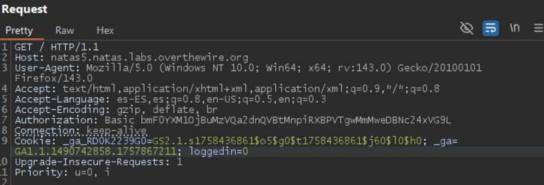
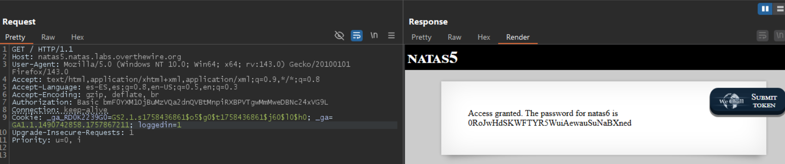

# Laboratorio OverTheWire — Natas level5

## Objetivo

Encontrar la contraseña para acceder al siguiente nivel, **natas6**.

## Acceso al nivel

Credenciales obtenidas del nivel anterior (**natas4**):

```
Username: natas5
Password: 0n35PkggAPm2zbEpOU802c0x0Msn1ToK
URL: http://natas5.natas.labs.overthewire.org/
```

## Descripción del reto

Al acceder a la página se muestra el mensaje:

> “Acceso denegado. No has iniciado sesión.”

## Identificación de la vulnerabilidad

El mensaje sugiere que el acceso depende de un estado de **sesión o autenticación**.
Al inspeccionar las cookies en las herramientas de desarrollo se detectó una cookie con el nombre `loggedin` cuyo valor era `0`, lo que indica un control de acceso basado en un valor booleano almacenado en el cliente (`0 = falso`, `1 = verdadero`). Esta implementación es insegura porque las cookies en el cliente son manipulables.

## Proceso paso a paso

1. **Inspección de cookies**
   En las herramientas de desarrollo o mediante Burp Suite se observa la cookie de sesión:

   

2. **Interceptar la petición**
   Usando Burp Suite (o una extensión que permita editar cookies), interceptar la petición HTTP realizada al servidor.

3. **Modificar la cookie**
   Cambiar el valor de la cookie `loggedin` de `0` a `1`:

   ```
   Cookie: loggedin=1
   ```

4. **Reenviar la petición modificada**
   Al reenviar la petición con `loggedin=1`, el servidor devuelve la página protegida y concede acceso.

   

y asi obtenemos la contraseña

```
Access granted. The password for natas6 is 0RoJwHdSKWFTYR5WuiAewauSuNaBXned
```
## Conclusión

La lección clave es implementar la verificación de autenticación y permisos en el servidor, no en valores del cliente.
